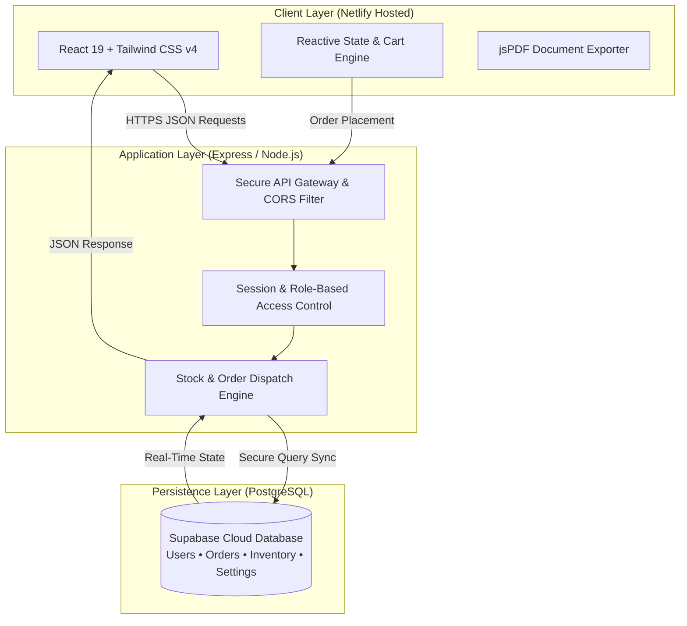

<div align="center">

# 🥦 SABJIES — Farm-Fresh Organic Grocery

### *Hyper-Local Farm-to-Fork Grocery & Fresh Produce Platform*

<br/>

[](https://sabjies.netlify.app)
[](https://react.dev)
[](https://www.typescriptlang.org/)
[](https://tailwindcss.com/)
[](https://expressjs.com/)
[](https://supabase.com/)
[](LICENSE)

<br/>

[🌿 **Explore Platform**](#-core-features) • [⚡ **Tech Stack**](#-technology-stack) • [🏗️ **Architecture**](#️-system-architecture) • [🚀 **Getting Started**](#-quick-start) • [👨‍💻 **Developer**](#-lead-developer)

<br/>

---

</div>

<br/>

## 📖 About The Project

**Sabjies** is a high-performance, modern full-stack web application designed to bring fresh, locally harvested vegetables and organic groceries directly to customers' doorsteps. Engineered with a lightning-fast responsive interface, intelligent cart calculations, multi-channel payment integrations, real-time inventory synchronization, and comprehensive operational dashboards.

> **Our Mission:** Deliver farm-fresh produce with zero compromise on quality, absolute pricing transparency, and an intuitive shopping experience.

<br/>

---

## ✨ Core Features & Highlights

<table>
  <tr>
    <td width="50%" valign="top">
      <h3>🥗 Customer Experience</h3>
      <ul>
        <li><b>Dynamic Produce Catalog:</b> Interactive filtering by categories (Leafy, Gourds, Roots, Herbs & Organic Specials).</li>
        <li><b>Smart Weight & Pricing Units:</b> Automatic adjustments for pricing per kg, 500g, or bunch.</li>
        <li><b>Animated Cart Drawer:</b> Real-time subtotal tracking, free-delivery threshold progress bar, and instant quantity controls.</li>
        <li><b>Address Book:</b> Multi-address management (Home, Work, Other) with instant cloud synchronization.</li>
        <li><b>Instant PDF Invoices:</b> Professional, tax-compliant invoice generator for all completed orders.</li>
        <li><b>Order Tracking:</b> Visual status tracking from packing to doorstep delivery.</li>
      </ul>
    </td>
    <td width="50%" valign="top">
      <h3>💳 Checkout & Payments</h3>
      <ul>
        <li><b>Seamless UPI Scan & Pay:</b> QR code integration compatible with GPay, PhonePe, Paytm, and BHIM.</li>
        <li><b>Razorpay Gateway:</b> Support for Debit/Credit Cards, NetBanking, and Digital Wallets.</li>
        <li><b>Cash on Delivery (COD):</b> Streamlined one-click confirmation for pay-at-doorstep convenience.</li>
        <li><b>Dynamic Coupon Engine:</b> Automated promotional discounts, seasonal vouchers, and minimum order rules.</li>
      </ul>
    </td>
  </tr>
  <tr>
    <td width="50%" valign="top">
      <h3>📊 Operations & Administration</h3>
      <ul>
        <li><b>Real-Time Analytics:</b> Visual revenue charts, active order counts, and customer metrics powered by Recharts.</li>
        <li><b>Live Inventory Management:</b> Instant stock editing, low-stock threshold triggers, and catalog updates.</li>
        <li><b>Order Pipeline:</b> Status updates (Confirmed ➔ Packed ➔ Out for Delivery ➔ Delivered).</li>
        <li><b>Customer Support & Settings:</b> Store operating hours, delivery radius fees, and custom announcement banners.</li>
      </ul>
    </td>
    <td width="50%" valign="top">
      <h3>🛡️ Reliability & Performance</h3>
      <ul>
        <li><b>Sub-second Page Speeds:</b> Built on Vite and optimized chunk splitting for near-instant rendering.</li>
        <li><b>Mobile-First Ergonomics:</b> Tailored touch targets and swipe interactions for mobile shoppers.</li>
        <li><b>Resilient Cloud Database:</b> Continuous data synchronization with PostgreSQL.</li>
        <li><b>Protected Sessions:</b> Secure, authenticated role-based access for customers and store managers.</li>
      </ul>
    </td>
  </tr>
</table>

<br/>

---

## 🛠️ Technology Stack

<div align="center">

| Domain | Technology | Description |
| :--- | :--- | :--- |
| **Frontend Framework** | `React 19` + `TypeScript` | Declarative, strictly-typed reactive component hierarchy |
| **Styling & Effects** | `Tailwind CSS v4` + `Motion` | Modern utility styling with smooth spring layout transitions |
| **Icons & Visuals** | `Lucide React` | Lightweight, scalable vector iconography |
| **Charts & Analytics** | `Recharts` | Composable SVG-based business intelligence charts |
| **Document Engine** | `jsPDF` + `html2pdf.js` | Automated client-side printable invoice generation |
| **Backend Framework** | `Node.js` + `Express` | High-throughput asynchronous REST server |
| **Cloud Database** | `Supabase PostgreSQL` | Relational data persistence with relational indexing |
| **Build & Bundler** | `Vite` + `esbuild` | Ultra-fast development and optimized production builds |

</div>

<br/>

---

## 🏗️ System Architecture



<br/>

---

## 🚀 Quick Start

Follow these simple steps to set up the project locally on your machine:

### 1. Clone the Repository
```bash
git clone https://github.com/your-username/sabjies-grocery.git
cd sabjies-grocery
```

### 2. Install Project Dependencies
```bash
npm install
```

### 3. Setup Local Configuration
Create your local environment file:
```bash
cp .env.example .env
```
*(Configure your desired ports and credentials inside `.env`)*

### 4. Start Development Server
```bash
npm run dev
```
Open your browser and navigate to: **`http://localhost:3000`**

### 5. Build for Production
```bash
npm run build
npm start
```

<br/>

---

## 👨‍💻 Lead Developer

<div align="center">

### **Faizan Shaikh**
*Full-Stack Engineer & Solution Architect*

[](mailto:faizanshaikh786511@gmail.com)
[](https://github.com)
[](https://maps.google.com)

<br/>

```text
Specializing in high-performance web applications, modern e-commerce architectures,
and enterprise-grade TypeScript ecosystems.
```

</div>

<br/>

---

## 📄 License

This project is licensed under the **MIT License** — see the [LICENSE](LICENSE) file for details.

<br/>

<div align="center">

Crafted with care by **Faizan Shaikh** • Delivering Farm Freshness Every Day 🥦

</div>
